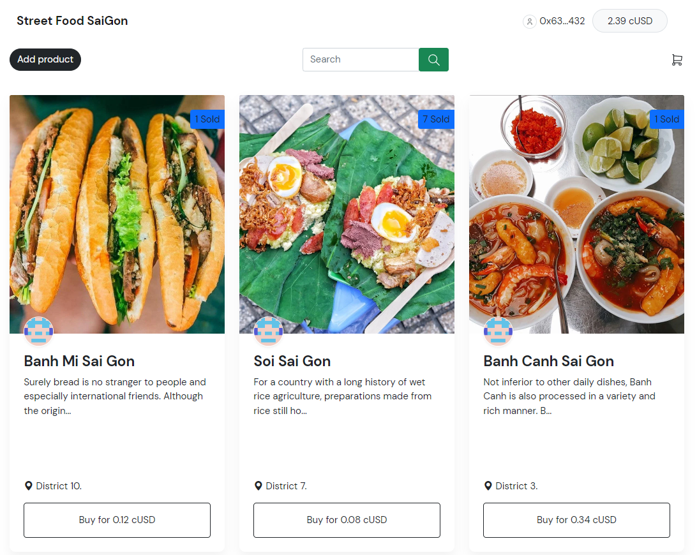
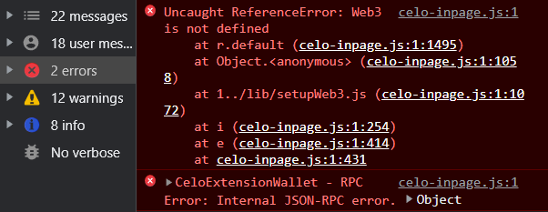

# Street Food SaiGon

Live Demo: https://ganzzi.github.io/Street-Food-SaiGon/



# Desciption

Welcome to Street Food SaiGon, a web application that allows users to browse and discover the best street food in SaiGon, Vietnam. This project was built as part of a coding challenge and serves as a showcase for my coding abilities.

# Features

```

1. Browse street food stalls by category
2. View detailed information about each stall, including photos and reviews
3. Leave your own reviews and ratings for stalls
4. Search for stalls by name or category
5. Add new stalls to the database (requires authentication)
6. Edit or delete your own stall entries (requires authentication)

```

# Smart Contract Functionality Added

- Get-purchased-product Function
- Remove product Function
- Update product Function

# Front End Functionality Added

- Update product Modal with the option to update price or cancel sale
- Conditional display by searching
- Display user's address
- View list of purchased product

# Usage

1. Install a wallet:
   - [CeloExtensionWallet](https://chrome.google.com/webstore/detail/celoextensionwallet/kkilomkmpmkbdnfelcpgckmpcaemjcdh?hl=en).
   - [MetamaskExtensionWallet](https://chrome.google.com/webstore/detail/metamask/nkbihfbeogaeaoehlefnkodbefgpgknn?hl=en).
2. Create a wallet.
3. Go to [https://celo.org/developers/faucet](https://celo.org/developers/faucet) and get tokens for the alfajores testnet.
4. Switch to the alfajores testnet in the CeloExtensionWallet.

# Test

1. Create a product.
2. Create a second account in your extension wallet and send them cUSD tokens.
3. Buy product with secondary account.
4. Check if balance of first account increased.
5. Add another product.
6. Search product in the marketplace by name.
7. Update the price of a product that you own.
8. Cancel the sale of a product you own.
9. View your purchased product.

# Installation

To run the application locally, follow these steps:

```

1. Clone the repository to your local machine using: git clone https://github.com/Ganzzi/Street-Food-SaiGon.git
2. Move into folder: cd Street-Food-SaiGon
3. Install: npm install or yarn install
4. Start: npm run dev

```

# Contributing

If you'd like to contribute to the project, please follow these steps:
Fork the repository to your own GitHub account
Clone the repository to your local machine
Create a new branch for your feature or bug fix using git checkout -b <branch-name>
Make your changes and commit them with a clear message
Push your changes to your branch using git push origin <branch-name>
Create a pull request on the original repository
I welcome any contributions or feedback on this project!

# Problems

There is some warnings and errors that I don't know how to fit:

